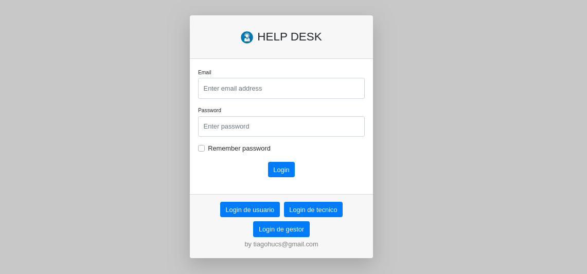
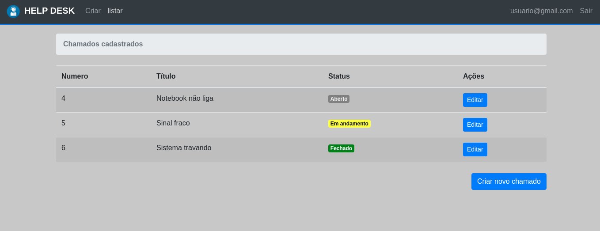

<br><br>

## 💻 Sobre o projeto

Este projeto é uma demostração de um Help Desk básico onde podemos criar, manter, monitorar e atender chamados

Empresa e usuario podem
- Criar um chamado
- Acompanhar o atendimento de um chamado
- Encerrar um chamado que ja foi resolvido

<div>

</div><br>
<div>

</div>
Obs: Mais funcionalidades estão sendo desenvolvidas

## 🛠 Tecnologias

As seguintes ferramentas foram usadas na construção do projeto:

- [Spring][spring]
- [Angular][angular]

## 🚀 Como rodar este projeto

💡 O Front End precisa que o Back End esteja sendo executado para funcionar.

### Pré-requisitos

Antes de começar, você vai precisar ter instalado em sua máquina as seguintes ferramentas:
[Maven](https://maven.com), [Angular][angular]. 
Além disto é bom ter um editor para trabalhar com o código como [IntelliJ][https://intellij.com]

### 🎲 Ambiente de desenvolvimento

## Back-end

```bash
# Clone este repositório
$ git clone https://github.com/TiagoHucs/SpringHelpDesk

# Acesse a pasta do projeto no terminal/cmd
$ cd SpringHelpDesk

# Instale as dependências
$ mvn install

# Inicie a aplicação local
$ mvn spring-boot:run -Drun.profiles=dev

# O servidor inciará na porta:5000
```

## Fron-end

```bash
# Acesse a pasta client do projeto no terminal/cmd
$ cd SpringHelpDesk/scr/main/client

# Instale as dependências
$ npm install

# Inicie a aplicação
$ npm run start

# O front inciará na porta:4200
```


## 📝 Licença

Este projeto esta sobe a licença MIT. Veja a [LICENÇA](license) para saber mais.

Feito com ❤️ por Tiago S. Hucs 👋🏽 [Entre em contato!](https://www.linkedin.com/in/tiagohucs/)

[spring]: https://spring.io/
[angular]: https://angular.io/
